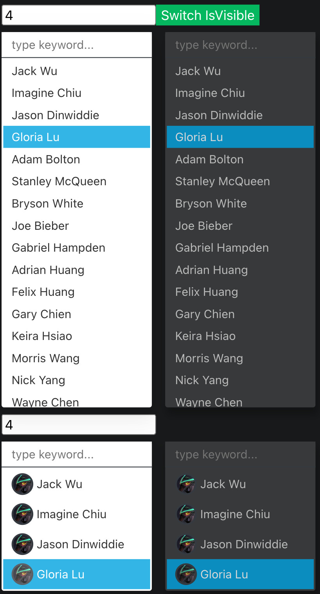

# bear-react-dropdown

> Datepicker library based for Reactjs

[](https://www.npmjs.com/package/bear-react-dropdown)
[](https://www.npmjs.com/package/bear-react-dropdown)




## Support Version Map

React | React Scripts | Bear React Dropdown | 
------|:--------------|--------------------:|
18    | 5.0.1         |               2.0.0 |


## Install

```bash
yarn add bear-react-dropdown
```

## Usage

add in your index.tsx
```tst
import "bear-react-dropdown/dist/index.css";

```

then in your page
```tsx
import {Dropdown, DropdownMulti} from 'bear-react-dropdown';


const BaseUsed = () => {
    const [value, setValue] = useState('');
    const [multiValue, setMultiValue] = useState<Array<string|number>>([]);
    
    const options1 = [
        {text: 'Jack Wu', value: '1'},
        {text: 'Imagine Chiu', value: '2'},
        {text: 'Jason Dinwiddie', value: '3'},
        {text: 'Gloria Lu', value: '4'},
    ];
    const options2 = [
        {text: 'Select option item...', value: '', avatarUrl: ''},
        {text: 'Jack Wu', value: '1', avatarUrl: asset('/images/avatar/female-1.jpg')},
        {text: 'Imagine Chiu', value: '2', avatarUrl: asset('/images/avatar/female-2.jpg')},
        {text: 'Jason Dinwiddie', value: '3', avatarUrl: asset('/images/avatar/female-3.jpg')},
        {text: 'Gloria Lu', value: '4', avatarUrl: asset('/images/avatar/female-4.jpg')},
    ];
    
    return (
        <div>
            <Dropdown value={value} onChange={setValue} options={options1} className="mr-3"/>
            <DropdownMulti value={multiValue} onChange={setMultiValue} options={options2} isDark/>
        </div>
    );

};
```


There is also a codesandbox template that you can fork and play with it:

[](https://codesandbox.io/s/bear-react-dropdown-1uvhiw)


## License

MIT © [imagine10255](https://github.com/imagine10255)
